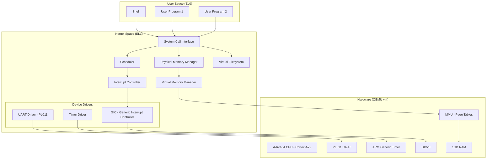
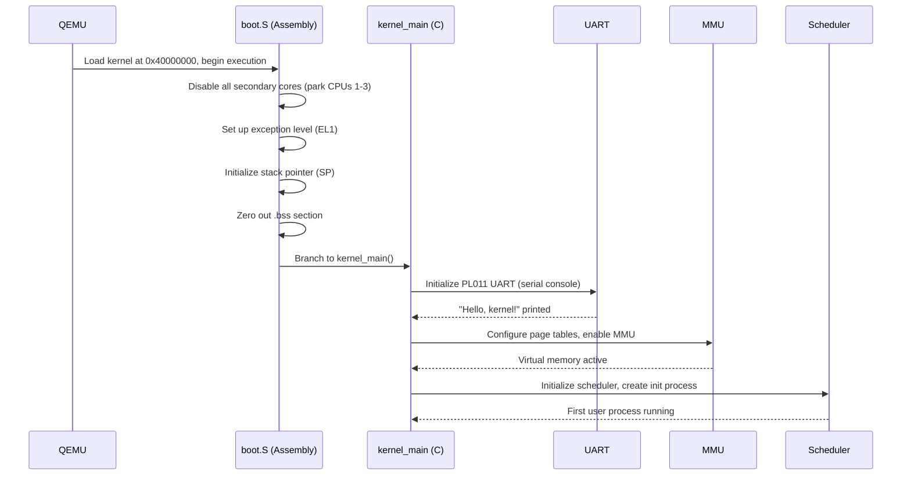
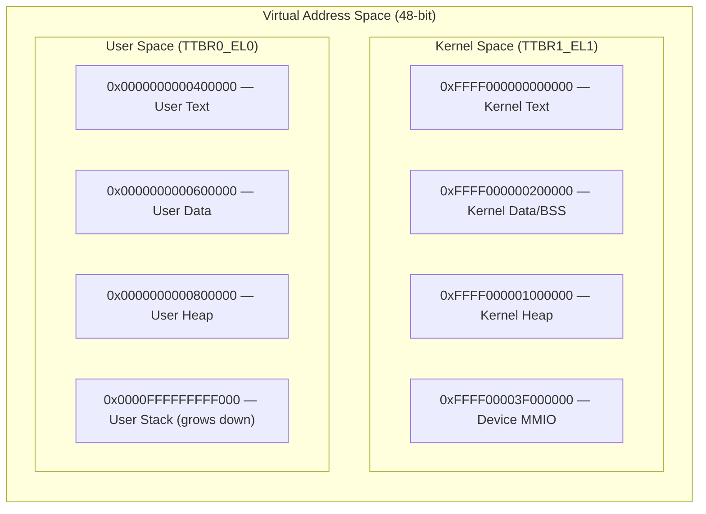
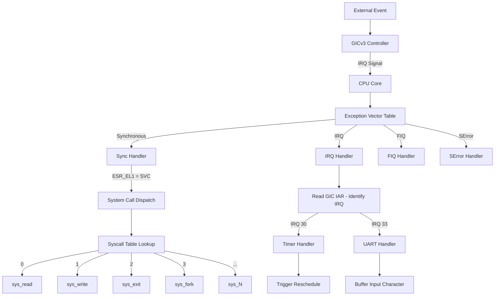
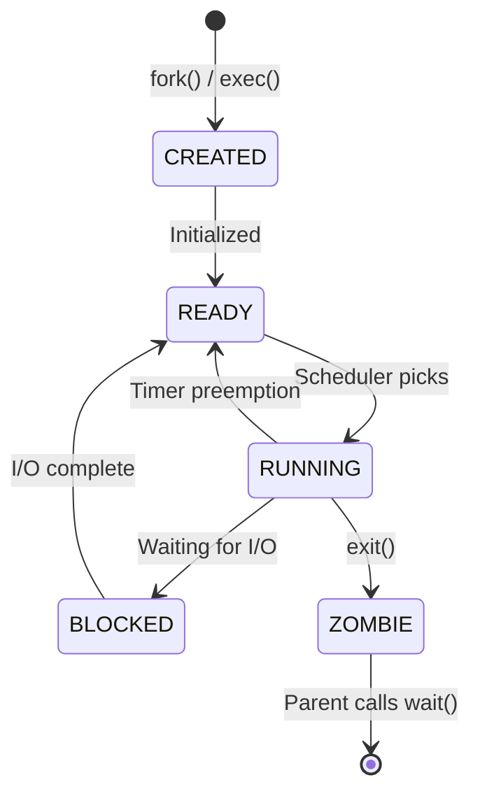
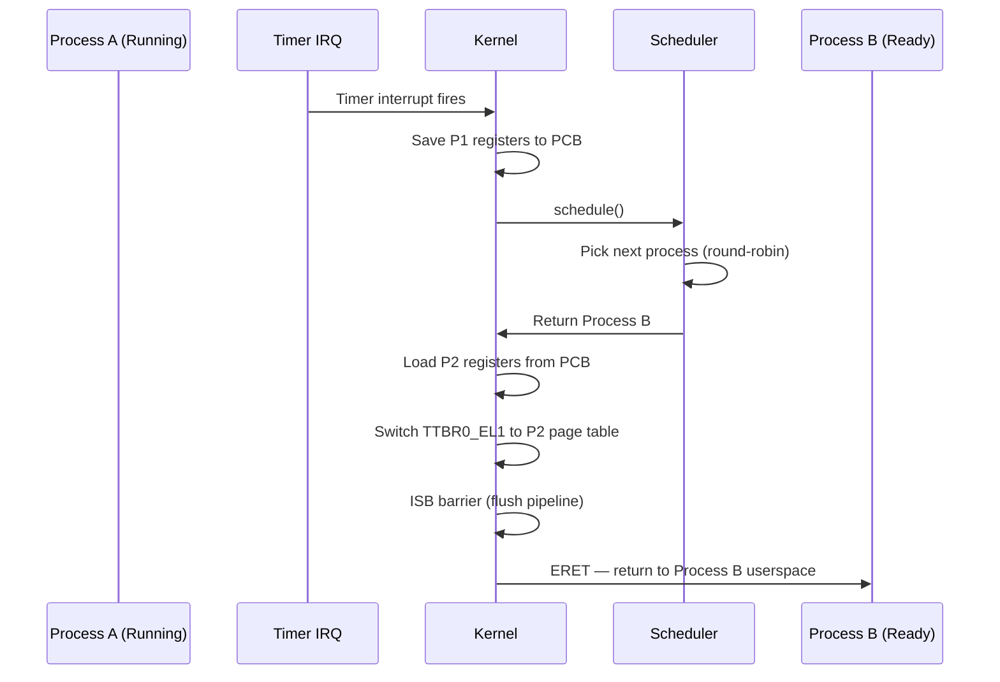
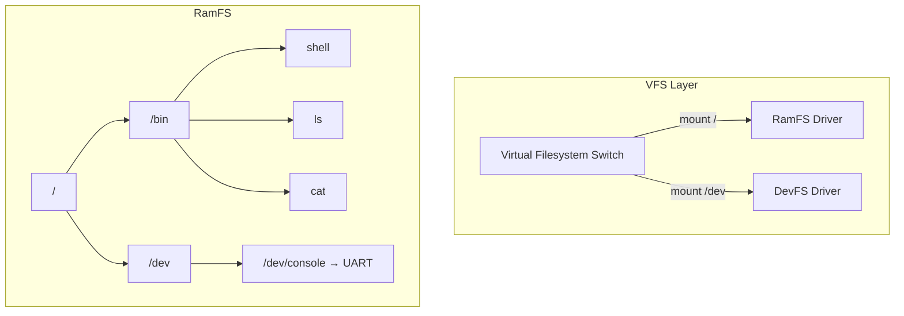

# ArmOS — An AArch64 Operating System Kernel from Scratch

A bare-metal operating system kernel targeting AArch64 (ARMv8-A 64-bit), built from the ground up as a deep-dive into how operating systems actually work. Every line of code is written by hand — no libraries, no frameworks, no shortcuts. Just C, assembly, and a QEMU virtual machine.

## Why Build an OS?

Operating systems are the foundation everything else runs on, yet most developers never look inside one. This project exists to change that — to build a working kernel and understand every layer: how a CPU boots, how memory is managed, how processes are scheduled, how user programs talk to the kernel.

This is not a production OS. It is a **learning machine** — optimized for clarity, heavily commented, and structured to teach.

## Architecture Overview



## Boot Sequence

The boot process takes the CPU from its initial reset state all the way into the kernel's `main()` function. Every step is explicit — there is no BIOS, no UEFI, no bootloader magic.



## Memory Layout

The kernel uses a flat memory model during early boot, then transitions to a full virtual memory layout once the MMU is enabled.

### Physical Memory Map (QEMU `virt` machine)

| Address Range | Size | Description |
|---------------|------|-------------|
| `0x00000000 - 0x08000000` | 128 MB | Flash memory (unused) |
| `0x08000000 - 0x08001000` | 4 KB | GICv3 Distributor |
| `0x08010000 - 0x08020000` | 64 KB | GICv3 CPU Interface |
| `0x09000000 - 0x09001000` | 4 KB | PL011 UART |
| `0x40000000 - 0x80000000` | 1 GB | RAM (kernel + user space) |

### Virtual Memory Layout



### Page Table Structure

AArch64 uses a 4-level page table with 4KB granule:

```
┌──────────────┬──────────┬──────────┬──────────┬──────────┬──────────────┐
│ Virtual Addr │ L0 [47:39] │ L1 [38:30] │ L2 [29:21] │ L3 [20:12] │ Offset [11:0] │
└──────────────┴──────────┴──────────┴──────────┴──────────┴──────────────┘
        │            │            │            │            │
        ▼            ▼            ▼            ▼            ▼
   48-bit VA    512 entries  512 entries  512 entries  512 entries   4KB page
                (512 GB)     (1 GB)       (2 MB)       (4 KB)
```

## Interrupt & Exception Handling

AArch64 uses an exception vector table aligned to 2048 bytes. Each entry handles a specific combination of exception type and source level.



### Exception Levels

| Level | Name | Purpose | Our Usage |
|-------|------|---------|-----------|
| EL3 | Secure Monitor | TrustZone | Not used (QEMU starts at EL1) |
| EL2 | Hypervisor | Virtualization | Not used |
| EL1 | OS Kernel | Privileged code | **Kernel runs here** |
| EL0 | User | Unprivileged code | **User programs run here** |

## Process Management



### Process Control Block (PCB)

```c
typedef struct process {
    uint64_t pid;                    // Process ID
    uint64_t state;                  // CREATED, READY, RUNNING, BLOCKED, ZOMBIE
    
    // Saved CPU context (on context switch)
    struct {
        uint64_t x[31];             // General-purpose registers x0-x30
        uint64_t sp;                // Stack pointer
        uint64_t pc;                // Program counter (ELR_EL1)
        uint64_t pstate;            // Saved processor state (SPSR_EL1)
    } context;
    
    uint64_t *page_table;           // TTBR0_EL1 — process page table
    void *kernel_stack;             // Kernel stack for this process
    void *user_stack;               // User stack base
    
    struct process *next;           // Linked list for run queue
    struct process *parent;         // Parent process
    int exit_code;                  // Exit status
} process_t;
```

### Context Switch Flow



## System Call Interface

User programs communicate with the kernel via the `SVC` (Supervisor Call) instruction. Arguments are passed in registers following the AArch64 calling convention.

| Register | Purpose |
|----------|---------|
| `x8` | System call number |
| `x0-x5` | Arguments 1-6 |
| `x0` | Return value |

### Planned System Calls

| Number | Name | Signature | Description |
|--------|------|-----------|-------------|
| 0 | `sys_read` | `read(fd, buf, count)` | Read from file descriptor |
| 1 | `sys_write` | `write(fd, buf, count)` | Write to file descriptor |
| 2 | `sys_exit` | `exit(status)` | Terminate current process |
| 3 | `sys_fork` | `fork()` | Create child process |
| 4 | `sys_exec` | `exec(path, argv)` | Replace process image |
| 5 | `sys_wait` | `wait(status)` | Wait for child process |
| 6 | `sys_getpid` | `getpid()` | Get process ID |
| 7 | `sys_sbrk` | `sbrk(increment)` | Grow process heap |
| 8 | `sys_open` | `open(path, flags)` | Open a file |
| 9 | `sys_close` | `close(fd)` | Close a file descriptor |

## Filesystem Design

A minimal RAM-based filesystem (ramfs) for loading and running user programs. No disk, no persistence — the entire filesystem lives in memory, populated at boot from an initial ramdisk image.



### Inode Structure

```c
typedef struct inode {
    uint64_t ino;           // Inode number
    uint32_t type;          // FILE, DIRECTORY, DEVICE
    uint32_t permissions;   // rwx bits
    uint64_t size;          // File size in bytes
    void *data;             // Pointer to file data (ramfs)
    
    // Directory entries (if type == DIRECTORY)
    struct {
        char name[256];
        uint64_t ino;
    } *entries;
    uint32_t entry_count;
} inode_t;
```

## Project Structure

```
OperatingSystemKernel/
├── boot/
│   ├── boot.S              # Entry point — CPU init, stack setup, BSS clear
│   └── linker.ld           # Linker script — memory layout for kernel image
├── kernel/
│   ├── main.c              # kernel_main() — initialization sequence
│   ├── panic.c             # Kernel panic handler
│   └── printk.c            # Kernel printf implementation
├── arch/
│   └── aarch64/
│       ├── exception.S     # Exception vector table (assembly)
│       ├── exception.c     # Exception/IRQ dispatch (C)
│       ├── mmu.c           # Page table setup, MMU enable
│       ├── timer.c         # ARM Generic Timer driver
│       └── context.S       # Context switch (assembly)
├── mm/
│   ├── pmm.c              # Physical page allocator (bitmap-based)
│   ├── vmm.c              # Virtual memory manager
│   └── kmalloc.c          # Kernel heap allocator
├── proc/
│   ├── process.c          # Process creation, destruction
│   ├── scheduler.c        # Round-robin scheduler
│   └── syscall.c          # System call table and dispatch
├── drivers/
│   ├── uart.c             # PL011 UART driver
│   └── gic.c              # GICv3 interrupt controller
├── fs/
│   ├── vfs.c              # Virtual filesystem switch
│   ├── ramfs.c            # RAM filesystem implementation
│   └── devfs.c            # Device filesystem (/dev/console)
├── user/
│   ├── shell.c            # Simple shell (user space)
│   ├── init.c             # Init process (PID 1)
│   └── libc/
│       ├── syscall.S       # User-space syscall stubs
│       ├── stdio.c         # printf, puts, getchar
│       └── string.c        # strlen, memcpy, strcmp
├── include/
│   ├── kernel.h           # Core kernel types and macros
│   ├── mm.h               # Memory management headers
│   ├── proc.h             # Process management headers
│   ├── fs.h               # Filesystem headers
│   ├── drivers/
│   │   ├── uart.h
│   │   ├── gic.h
│   │   └── timer.h
│   └── arch/
│       └── aarch64.h      # Architecture-specific definitions
├── Makefile               # Build system
├── PLANNING.md            # Development plan and phases
└── README.md              # This file
```

## Build & Run

### Prerequisites

```bash
# macOS (Homebrew)
brew install aarch64-none-elf-gcc qemu

# Ubuntu/Debian
sudo apt install gcc-aarch64-linux-gnu qemu-system-aarch64

# Arch Linux
sudo pacman -S aarch64-linux-gnu-gcc qemu-system-aarch64
```

### Build

```bash
make            # Build the kernel image
make clean      # Clean build artifacts
make debug      # Build with debug symbols (-g -O0)
```

### Run

```bash
make run        # Boot kernel in QEMU
make debug-run  # Boot with GDB server on port 1234
```

### Debug with GDB

```bash
# Terminal 1
make debug-run

# Terminal 2
aarch64-none-elf-gdb build/kernel.elf
(gdb) target remote :1234
(gdb) break kernel_main
(gdb) continue
```

## Development Phases

### Phase 1: Boot & UART
Get the CPU to boot, set up a stack, jump to C, and print "Hello, kernel!" over the serial console. This is the foundation — if you can print, you can debug everything else.

### Phase 2: Interrupts & Exceptions
Set up the exception vector table, configure the GIC interrupt controller, and handle timer interrupts. This gives the kernel the ability to respond to hardware events and is prerequisite for preemptive scheduling.

### Phase 3: Memory Management
Implement a physical page allocator (bitmap-based), configure the MMU with 4-level page tables, and establish the kernel virtual address space. After this phase, the kernel runs entirely in virtual memory.

### Phase 4: Process & Scheduling
Create the process control block, implement context switching in assembly, and build a round-robin scheduler driven by the timer interrupt. Two kernel tasks should be able to run concurrently.

### Phase 5: System Calls & User Space
Implement the EL0↔EL1 transition via `SVC`, build a syscall dispatch table, and run the first user-space program. This is the boundary between kernel and user — the most important abstraction in the entire OS.

### Phase 6: Filesystem & Shell
Build a simple RAM-based filesystem, implement an ELF loader, and create a basic shell. At the end of this phase, you can type commands and run programs — a real, working operating system.

## References & Learning Resources

- [ARM Architecture Reference Manual (ARMv8-A)](https://developer.arm.com/documentation/ddi0487/latest)
- [osdev.org — OSDev Wiki](https://wiki.osdev.org/)
- [Writing an OS in Rust (Philipp Oppermann)](https://os.phil-opp.com/) — x86 focused but concepts transfer
- [QEMU Virt Machine Documentation](https://www.qemu.org/docs/master/system/arm/virt.html)
- [Linux Kernel Source — arch/arm64/](https://github.com/torvalds/linux/tree/master/arch/arm64) — the gold standard reference
- [Xv6 (MIT)](https://github.com/mit-pdos/xv6-riscv) — simple teaching OS, great for understanding concepts

## License

MIT — learn from it, fork it, build on it.
